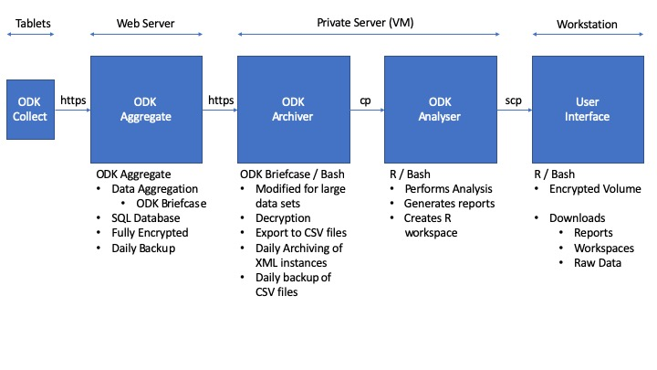

# OBD : ODK for Big Data

## Summary  

A system for working with very large data sets in ODK, programmed in bash with ODK tools

**Features**

* Useful when working with >20,000 submissions to a form
* Headless automation for working with cron
* Efficient headless pulls of data using ODK Briefcase
* Support for many forms
* Automatic decryption and building of CSVs
* Efficient exports of data to CSV
* Self-archiving of xml instances
* Self-archiving of CSV tables
* Auto resumes pull/export from date of last pull/export date
* Portable between systems
* Restore to new computer resumes from previous position
* Recoverable from backup 

## Introduction

The ODK tool suite may struggle to cope with very large numbers (>10<sup>5</sup>) of submissions. in general the slowdown comes from the very long periods it takes for `ODK Briefcase` to scan through thousands or millions of submissions and to identify those which should be pulled or exported from those which have already been processed in these ways.  

The **ODK for Big Data [OBD]** scripts are a solution aimed at making the experience of using ODK for handling big data sets as efficient as possible. On tests with a set of forms in which we received more than one million submissions, we reduced the time taken to pull, export and analyse the data from around 19 hours to 12 minutes each day. The majority of the tools are simply adapted uses of existing ODK tools, supplemented with scripts written in bash and R which act as handlers and manipulators of the data. In it's simplest form the **ODB** system creates time efficiencies by archiving old xml instances away from the main `ODK Briefcase Storage` folders, thereby removing the need to scan through lots of old submissions. Along the way we create incremental backups of data exports, methods for recovery from system failures and for enabling portability between different physical and virtual machines. Finally we provide some examples of supporting files that can be used to automate all pulls, exports and analyses and to pull final reports, R workspaces and raw CSV outputs from a server running **OBD** to a local workstation for downstream end-users.

*Background on the problem*

The ODK Briefcase `start from last [-sfl]`, `start from date [-sfd]` and export counterparts of these functions `export start [-start]` and `export end [-end]` are useful tools that have limitations when working with large numbers of submissions. 

`-sfl` remembers the position of the last pulled instance and by doing so vastly speeds up *pull* operations, but the 'memory' of the last position is not stored as hardcoded data within the `ODK Briefcase Storage` folder so it is not portable between systems. This means that if the `ODK Briefcase Storage` folder is moved to another machine, the system resets to the first submission and has to read through from the start again. On long lived forms this could lead to dozens of hours of pulling and on very large submissions could fail entirely. We've observed significant server strain when performing this kind of "start from scratch" re-pulling after disasters struck.

`-sfd` is a potentially more controllable counterpart to `-sfl` but has no built in system to make the system aware of any previous pulls, meaning that for any automated system the `-sfd` date must be somehow stored in a coherent way and preferably within the `ODK Briefcase Storage` folder. In the **OBD** ecosystem we use `-sfd` in combination with a form specific `nextpull.txt` file. This file keeps track of when pulls have happened and is described below in detail. This system makes `-sfd` perform in an equivalent manner to `-sfl` but with more end-user control and with portability across machines, meaning that an `ODK Briefcase Storage` folder can be copied to a new machine and the pull process will resume as if nothing had happened.

We use `-start` and `-end` during exports to make an appended export that is informed by the date information stored in the `nextpull.txt` file for each form. Like with the `-sfd` modifications we've made, this makes export processes aware of previous progress, recoverable from disasters and seamlessly portable across machines

The **OBD** system puts a firebreak between the pull/export activities and downstream analyses by containerising the former in one folder (*Archiver*) and the latter in an entirely separate folder (*Analyser*). The *Analyser* scripts simply copy the CSV files contained in the `Archiver/Data/Output` folder in to their own mirror folder `Analyser/Data/Output` meaning that any errors in downstream analysis that could harm the integrity of the living CSV files are isolated to the mirrored copies and are therefore harmless to the ones in the *Archiver* system.  


  
  
**Figure 1 : Schematic of OBD system**  : Android tablets running ODK Colllect send data to an instance of ODK Aggregate on a web-facing server. The scheduled *ODK Archiver* system, running on a secure private server, performs regular [i.e. daily] automatic pulls and exports of the data, backing everything up and maintaining portability. The scheduled *ODK Analyser* automatically pulls a copy of exported CSV files across a firebreak and runs downstream analysis in R and bash, creating reports, documents and an R workspace file. The reports and workspaces are copied across scp to a local workstation by users with sftp access to the secure server. The R workspace can be loaded to view and perform further analysis. Reports can be shared as is. 


## Requirements

The system requires some fairly standard linux/unix tools. Whilst the whole infrastructure will work on a single machine, even a laptop, we designed it to work on three separate systems (a web-facing ODK aggregate server, a private server virtual machine and a local workstation)

You need the following (possibly incomplete) list of stuff  

* ODK Aggregate
* R / Rstudio 
* ODK Briefcase
* Mutt (if you want cron to send you an email when your reports are ready)
* Java SDK
* SSH keys for ODK briefcase
* SFTP access to the private server VM
* Pandoc


### First run  
* Use the ODK Briefcase Java Jar GUI to set up the `ODK Briefcase Storage` folder within the `Archiver/Data` folder
* ODK Briefcase CLI can't make this folder, so need to run the GUI at least once
* If working with a VM that doesn't have a desktop, you could make the `ODK Briefcase Storage` folder on another machine and copy across, or use a virtual desktop  


### Archiver
* Make the `ODK_Archiver.sh` executable with `chmod +x ODK_Archiver.sh`
* Put your ODK decryption keys in the `Archiver/keys` folder
* Open the `ODK_Archiver.sh` script in a text editor

* Change lines in the `ODK_Archiver.sh` file to suit your server 

In this section...  

```
#!/usr/bin/env bash

#########################################################################################
## USER DEFINED VARIABLES
#########################################################################################
ODK_STORAGE_PATH="Data"
ODK_EXPORT_PATH="Data/Output"
URL="https://serverURL/submission_dir/"
ODKUSERNAME="admin"
PEM="keys/NAME.pem"
#########################################################################################
```

* Change the URL to you server, not forgetting to include the main submission directory
* Set your Username
* Set the PEM varibale with the path to your decryption key

  
  
In this section...  

```
#########################################################################################
## ADD ODK FORM IDs BELOW THIS LINE  (FORMID;FORMNAME) replace and . with _
#########################################################################################
"TEST_1001;PARTICIPANTS"
"TEST_1002;LAB_DATA"
"TEST_1003;ENVIRONMENT_DATA"
#########################################################################################
```  


* Add the form IDs and form names in the format `FORMID;FORM_NAME`
* If you are unsure of these, check your settings sheet in xlsform
* or use the form management page on your server website  


When running, the script will look for a file called `nextpull.txt` in the `ODK briefcase Storage/forms` folder for each form  

* i.e. `/ODK Briefcase Storage/forms/PARTICIPANTS/nextpull.txt`  

The contents of this file are very simple and take the form of

```
NEXTPULL=2019-06-19
```
where the user is able to modify the date in the format YYYY-MM-DD to control the behaviour of the system on the next pull.

During the data pull and extract, *ODK archiver* uses this file in several ways, iterating the operations over all forms defined in the section above

* If the file is not there, it creates it and sets the date of the next pull to `1970-01-01`
* Gets the date of the next pull, which by default is exactly one day after the last pull was completes  
* Runs an `ODK Briefcase` *pull* operation, using the *start from date* `-sfd` option, informed by the contents of `nextpull.txt`
	* This pulls all data from the `ODK Aggregate server` that were submitted on or after the `nextpull.txt` date
* Exports data from the form submissions in the `ODK Briefcase Storage/forms/FORMID/instances` folder using `-start [nextpull date]` and `-end today's date - 1 day` 
	* This exports everything from the `nextpull` date until 2359 on the day before the pull happens (i.e up until midnight this morning)
	* Exported data is appended to last version of the CSV file 
* Checks for and creates [if absent] a new folder `ODK Briefcase Storage/forms/form_name/archive`
* Creates a subfolder i.e. `ODK Briefcase Storage/forms/form_name/archive/YYYY-MM-DD_HH_MM_SS` where the timestamp is the current time
* Makes a backup copy of the new CSV file with datestamped name 
	* i.e. `ODK Briefcase Storage/forms/form_name/archive/2019-06-18_03_00_00.csv` 
* Moves all XML instances from `ODK Briefcase Storage/forms/form_name/instances` to `ODK Briefcase Storage/forms/form_name/archive/YYYY-MM-DD_HH_MM_SS/instances`, thus clearing out the original instances folder
* Writes the new `nextpull.txt` file, replacing the old date with today's date

The up to date CSV data for the various forms will always be aggregated in the `Archiver/Data/Output` folder with names that are fixed i.e. `PARTICIPANTS.CSV`, allowing for other processes to copy out the files remotely and without needing to update target file names.

***
**Recovery** from system failure is a simple process

1) Restore the most recent CSV backup file to the `Archiver/Data/Output` folder  
2) Change the name to i.e. `PARTICIPANTS.CSV`   
3) Change the date in the appropriate `nextpull.txt` file to match the date of the restored file  
***

#### Directory tree for a typical Archiver installation

```
Archiver
├── Archiver.cron.log
├── Data
│   ├── ODK\ Briefcase\ Storage
│   │   ├── cache.ser
│   │   ├── forms
│   │   │   ├── FORM_NAME
│   │   │   │   ├── FORM_NAME.xml
│   │   │   │   ├── archive
│   │   │   │   │   ├── 2019-06-11
│   │   │   │   │   │   ├── 2019-06-11.csv
│   │   │   │   │   │   └── instances
│   │   │   │   │   ├── 2019-06-12_11_30_42
│   │   │   │   │   │   ├── 2019-06-12_11_30_42.csv
│   │   │   │   │   │   └── instances
│   │   │   │   │   │       ├── uuid03abd8a0-69a8-40f7-b4c0-bd183403abce
│   │   │   │   │   │       │   ├── submission.xml
│   │   │   │   │   │       │   └── submission.xml.enc
│   │   │   │   │   │       ├── uuid05aa1582-7649-4d29-8335-096a6a32c9b3
│   │   │   │   │   │       │   ├── submission.xml
│   │   │   │   │   │       │   └── submission.xml.enc
│   │   │   │   │   │       ├── uuid08703d64-b1a4-492d-9fa2-806db1ef9e7c
│   │   │   │   │   │           ├── submission.xml
│   │   │   │   │   │           └── submission.xml.enc
│   │   │   │   │   └── 2019-06-12_11_36_17
│   │   │   │   │       ├── 2019-06-12_11_36_17.csv
│   │   │   │   │       └── instances
│   │   │   │   │           └── uuid0a08a7ac-0bf5-474e-9535-ed47c11761cd
│   │   │   │   │               ├── submission.xml
│   │   │   │   │               └── submission.xml.enc
│   │   │   │   ├── info.hsqldb
│   │   │   │   │   ├── info.log
│   │   │   │   │   ├── info.properties
│   │   │   │   │   ├── info.script
│   │   │   │   │   └── info.tmp
│   │   │   │   ├── instances
│   │   │   │   └── nextpull.txt
│   │   │   └── FORM_NAME_2
│   │   │       ├── FORM_NAME_2-media
│   │   │       │   └── itemsets.csv
│   │   │       ├── FORM_NAME_2.xml
│   │   │       ├── archive
│   │   │       │   ├── 2019-06-11
│   │   │       │   │   ├── 2019-06-11.csv
│   │   │       │   │   └── instances
│   │   │       │   ├── 2019-06-12_11_30_42
│   │   │       │   │   ├── 2019-06-12_11_30_42.csv
│   │   │       │   │   └── instances
│   │   │       │   │       ├── uuid000dcd38-75e0-4dbe-96eb-e46157e22f76
│   │   │       │   │       │   ├── submission.xml
│   │   │       │   │       │   └── submission.xml.enc
│   │   │       │   │       ├── uuid004a5452-2017-48bf-984c-9691017be993
│   │   │       │   │       │   ├── submission.xml
│   │   │       │   │       │   └── submission.xml.enc
│   │   │       |   ├── info.hsqldb
│   │   │       │   ├── info.log
│   │   │       │   ├── info.properties
│   │   │       │   ├── info.script
│   │   │       │   └── info.tmp
│   │   │       ├── instances
│   │   │       └── nextpull.txt
│   │   └── readme.txt
│   └── Output
│       ├── 000_timestamp.txt
│       ├── FORM_NAME.csv
│       ├── FORM_NAME_2.csv
|
├── ODK-Briefcase-v1.15.0.jar
├── ODK_Archiver.sh
├── REPORTS_190611.1549.zip
├── briefcase.2019-06-12.log
├── briefcase.2019-06-13.log
├── briefcase.2019-06-14.log
├── briefcase.2019-06-15.log
├── briefcase.2019-06-16.log
├── briefcase.2019-06-17.log
├── briefcase.2019-06-18.log
├── keys
│   └── PRIVATE.KEY.pem
├── pass.sh
├── report.txt
└── serverpass.txt


```


### Analyser
* Make `000_run_analysis.R` executable with `chmod +x 000_run_analysis.R`
* Open `000_run_analysis.R` and edit it to match your needs

* Change this line if your want R's output sent to a file other than `analysis.log`

```
con<-file("analysis.log")
```

You may need to change the location of pandoc to match your system
* at command line type `which pandoc` to find the location on your system

```
#set pandoc
Sys.setenv(RSTUDIO_PANDOC="/usr/local/bin/")
```
Set the timezone you want to work in

```
Sys.setenv(TZ='GMT')
```

Change the path for your Archiver folder

```
#get data from Archiver
################################################################################################################
{
  rm(list=ls())
  unlink("Output/",recursive = T)
  system("cp -rf /INSERT_PATH_HERE/Archiver/Data/Output/  ./Output")
  unlink("report/",recursive = T)
  unlink("*.zip")
}
```

Set the directories (leave them alone really)

```
#directories
export.dir.name <- paste(getwd(),"Output",sep="/")
report.dir.name <- paste(getwd(),"report",sep="/")
storage.dir.name <- paste(getwd(),"xmls",sep="/")
```
Add your main analysis at this line. We like to source other R scripts here.

```
#DO STUFF HERE
```

Change the names of your outputs if you want to

```

zipr(zipfile=paste("REPORTS_",format(Sys.time(), "%y%m%d.%H%M"),".zip",sep=""),files=report.dir.name)

timestamp()

message("writing workspace")
save.image(compress = "gzip",safe = TRUE,file = "Workspace.Rdata")


```

#### Directory tree for a typical Archiver installation

```
Analyser
├── 000_run_EDK0010_analysis.R
├── workspace.Rdata
├── rproject.Rproj
├── REPORTS_190619.0533.zip
├── Output
│   ├── 000_timestamp.txt
│   ├── FORM_NAME.csv
│   ├── FORM_NAME_2.csv
├── Other_analysis_scripts
├── analysis.log
├── pass.sh
└── report
    ├── Report_FORM_NAME_190619.0533.txt
    ├── Report_FORM_NAME_2_190619.0533.txt
    ├── data_flow.PDF
    └── maps
        ├── map_1.kml
        ├── leaflet_map.html
        └── leaflet_map_files
            ├── Proj4Leaflet-1.0.1
            │   ├── proj4-compressed.js
            │   └── proj4leaflet.js
            ├── ...


```

### Automation  
By now you should have the *Archiver* and *Analyser* systems ready to run. The next step is to schedule the runs using the `cron` system that is built in to all linux/unix systems. If you don't know what you are doing with this, learn about it before you do something dangerous


#### Crontab

To access your crontab file, command line `export VISUAL=nano; crontab -e`

* Add explicit path to any folder and explicit path to any command including interpreter
	* i.e. don't use `./run.sh` but `sh run.sh`
	* i.e. don't use `zip` but `usr/bin/zip`

* Make all R scripts etc executable
* You may also need to `chown` some of these things to user `cron`
* It will be trial and error as usual!


**Example Crontab**

```
#* * * * *  command to execute  
#│ │ │ │ │  
#│ │ │ │ └ day of week (0 - 6) (0 to 6 are Sunday to Saturday,    
#│ │ │ │   or use names; 7 is Sunday, the same as 0)  
#│ │ │ └──────── month (1 - 12)  
#│ │ └───────────── day of month (1 - 31)  
#│ └────────────────── hour (0 - 23)  
#└─────────────────────── min (0 - 59)  

##################################################################################################################################################################################################################################################################################
#run archiver at 0100  
0 1 * * * cd /Users/ADD_USER/PATH/Archiver && sh ODK_Archiver.sh  > /Users/ADD_USER/PATH/Archiver/Archiver.cron.log 2>&1 && /usr/local/bin/mutt -s "Archiver/Rwanda Reports" < report.txt -- person@mail.com  
#run analyser at 0130  
30 1 * * * cd ~/Documents/Analyser/ && /usr/local/bin/Rscript /Users/ADD_USER/PATH/Analyser/000_run_analysis.R  
####################################################################################################################################################################################################################################################################################
```
This cron will `cd` to your *Archiver* directory at 1 am each day, then run the scripts to pull and export data [sending info to an easily found cron.log file]. Here we also use `mutt` on a pipe to send an email to tell us that things have worked. The file called `report.txt` says something like "Your data are done, love from your computer" and will become the body of the mail. The `-S` argument to `mutt` is the subject of the mail. This is all optional

Then it will `cd` again at 1.30 am to your *Analyser* directory and run the scripts there. You'll end up with all your reports on your system by the time you get up for breakfast. 

To access them, you can set up a little script that grabs all the data from the server on a double click. 

To achieve that we've written two simple scripts

1) Is an R script that invokes an `scp` command and does some fun stuff with backups. This will only work if you use `scp` having already put your ssh keys on the server (i.e. by loggin in to the server and running a line like ```cat ~/.ssh/id_rsa.pub | ssh username@server.address.com 'cat >> ~/.ssh/authorized_keys'```
 . If not you could use sshpass, providing a password in a file, or use clearpass R package to provide a password on the fly in an interactive session. 


```
#requires scp so make sure ssh keys have been put on server. 

args = commandArgs(trailingOnly=TRUE)
setwd(args)
message (paste("Directory is :",args))


# If data connection is low, please set the below to 0. 

get_rdata<-1
get_raw_data<-1

#Get EDK0003 Rwanda data
{
  try(dir.create("Store/Archive",recursive = T))
  try(dir.create("Store/Rdata",recursive = T))
  try(system("mv Store/*.zip Store/Archive/" ))
  try(unlink("Store/Output",recursive = TRUE))
  try(unlink("Store/report",recursive = TRUE))

  system(paste("scp -r user@1.1.1.1:/Users/USERNAME/PATH/Analyser/Analyser/*.zip Store/",sep=""))

  system("unzip Store/REPORTS_* -d Store")

if(get_rdata==1)
{
  system(paste("scp -r user@1.1.1.1:/Users/USERNAME/PATH/Analyser/*.Rdata Store/Rdata",sep=""))
}

if(get_raw_data==1)
{
  system(paste("scp -r user@1.1.1.1:/Users/USERNAME/PATH/Analyser/Output Store/Rdata",sep=""))

}

}
```


2) Is a little script that runs the Rscript on a double click

```
#!/bin/bash
BASEDIR=$(dirname $0)
echo "Script location: ${BASEDIR}"
/usr/local/bin/Rscript ${BASEDIR}/1_getalldata.R ${BASEDIR}

```

To make this work, first use cat to remove file attributes, i.e. run `cat file.sh > file` then make the new thing executable with `chmod +x`
Now this will run when you double click it and will download the data to whatever folder the app is in.  

###Backup

We backup everything on the VM to a second VM using Rsync. An example is provided in the `sync.commands.sh` file.

To use a system like this requires you to put your VM server's ssh keys on the backup server or to use sshpass. Otherwise could simply use a cp command to move to an external/networked drive

```
#!/usr/bin/env bash

date

echo SYNCING STUDY NAME

/usr/bin/rsync -raz -v /Users/USERNAME/PATH/Archiver user@URL:/PATH/ODKbackup
/usr/bin/rsync -raz -v /Users/USERNAME/PATH/Analyser user@URL:/PATH/ODKbackup
```

You'd also want to put a line in your crontab to run backup each day

```
##############################################################################################
0 12 * * * sh /Users/PATH/sync.commands.sh > /Users/PATH/sync.cron.log

```
